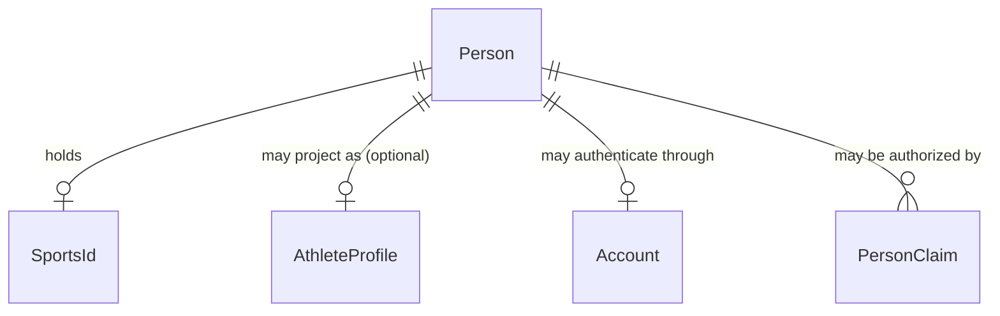
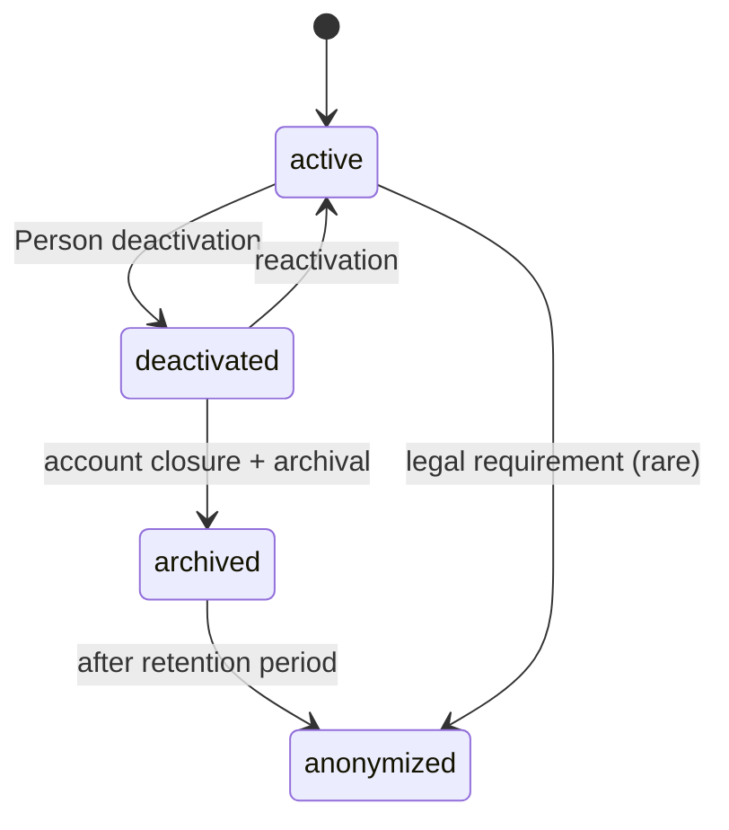

# Identity Model

> Defines `Person`, `User`, `AthleteProfile`, and `SportsId`. See ADR-002,
> ADR-003, ADR-010, ADR-011, `person-role-model.md`.
>
> **[S4]** `Person` and `SportsId` are now durably persisted in PostgreSQL
> (platform-global, no `tenantId`), created together in one transaction. Date of
> birth is stored as private data and never exposed by public lookups. See
> `../persistence-model.md` and ADR-020.

## Person vs Account vs AthleteProfile

These are **distinct** concepts. Conflating them is the most common modeling
error in sports platforms and is explicitly forbidden here.

| Concept | What it is | Lifecycle | Identity | Ownership [C] |
|---|---|---|---|---|
| **Person** | The natural/legal human being. The permanent identity subject. | Survives account closure via deactivation/archival. Holds the Sports ID forever. | `Id<"Person">` | Platform-global (no `tenantId`) |
| **Account** | The platform link from one externally authenticated subject to one Person. It contains no credentials or sports/profile data. | Can be active or disabled independently of Person lifecycle. | `Id<"Account">` | Platform-global |
| **AthleteProfile** | An **optional** sport-independent sporting identity projection of a Person. | Created only when a Person becomes an athlete. One per Person max. | `Id<"AthleteProfile">` | Person-owned (no `tenantId`) |

Key rules:

- A **Person** has at most one **Sports ID** (R2). The Sports ID is permanent
  and **platform-global** [C] — it does not belong to any tenant or organization.
- **[S5]** A **Person** may have zero or one **Account**. Every Account maps to
  exactly one existing Person, and its `authSubject` uniquely identifies the
  external Supabase Auth user. Creating a Person does not create an Account.
- Supabase `auth.users` remains an external authentication identity. Account is
  the platform bridge to Person; it stores no passwords, tokens, Sports ID, or
  AthleteProfile data. Provider-specific session/user types stay in adapters.
- **[S5.1]** Authentication answers “Who is logged in?” It does not authorize
  an arbitrary Person linkage. A single-use `PersonClaim` answers “Which
  existing Person may this identity claim?” Only a valid pending, unexpired
  claim supplies the Person ID used to create the Account.
- **[C]** A Person **MAY** have at most one `AthleteProfile` (R3). A Person
  does **not** automatically become an athlete. A Person may exist only as a
  coach, guardian, official, organizer, staff member, sponsor representative,
  etc., with no AthleteProfile at all.
- When an AthleteProfile exists, it is **sport-independent**. It participates
  in many sports (R4) via `AthleteSportParticipation`; it is not re-created
  per sport.
- A minor Person may have **no User** of their own; a guardian Person's User
  acts on their behalf (R19).



> **[S3]** `AthleteProfile` is now modelled in a dedicated **Athlete** bounded
> context (`src/domain/athlete/`, ADR-019), not inside Identity. Identity remains
> the source of personal identity; the Athlete context references the Person by
> `Id<"Person">` only. Guardian relationships are **not** part of Person — they
> are a separate `GuardianRelationship` concept in the Auth context.

Note: Person → AthleteProfile is `||--o|` (zero or one), not `||--||` (exactly
one). A Person may never have an AthleteProfile.

## Sports ID model

A `SportsId` is:

- **Permanent.** Once issued it is never reassigned to another Person.
- **Platform-issued.** Never chosen by the person. Generated by the
  application-owned `SportsIdGenerator` [S2] as an opaque, collision-resistant
  value; the use case verifies global uniqueness before issuance.
- **Encodes no sensitive or contextual data** [S2]. No birth date, gender,
  location, sport, tenant, or organization. The public, human-readable format
  (`SID1-...`) is versionable and an implementation detail.
- **Platform-global** [C]. Not tenant/organization-owned. A Person's Sports ID
  persists regardless of which organizations or events they participate in.
- **Single.** A Person has at most one.
- **Separate from QrCredential** [C]. The Sports ID is the permanent identity
  value. QR credentials are rotatable/revocable artifacts that point to the
  person. Revoking a QR never changes the SportsId.
- **Revocable** (`status: "revoked"`) but the revocation is recorded; the ID
  value is never reused.

```typescript
interface SportsId {
  value: Id<"SportsId">;      // opaque, globally unique, permanent
  issuedAt: ISODateString;    // set once, at issuance
  status: "active" | "revoked";
}
// Constructed via issueSportsId(value, issuedAt); never assembled by hand.
```

### Issuing identity [S2]

Creating a Person and issuing its Sports ID is a single logical operation,
implemented by the `CreatePerson` use case (see
`docs/vertical-slices/create-person.md`). An active Person always has exactly
one Sports ID; the Person ID and the Sports ID are distinct identifiers, and the
QR credential remains a separate, not-yet-implemented concept. The operation
produces two domain facts — `PersonCreated` and `SportsIdIssued` — that carry
only identifiers, never personal data.

## AthleteProfile [S3] (Athlete context)

The `AthleteProfile` is a sport-independent sporting identity, now owned by the
dedicated **Athlete** bounded context (ADR-019). It is:
- **Optional** — a Person may never have one.
- **At most one** per Person.
- **Person-owned** [C] — not owned by any organization. An organization fields
  a person on a team via `TeamMembership`, but the AthleteProfile belongs to
  the Person.
- **Sport-independent** — no sport field. Sport linkage is via
  `AthleteSportParticipation`.
- **Free of Person identity data** — it holds no display name, date of birth,
  or Sports ID. Person remains the single source of those.

```typescript
interface AthleteProfile {
  id: Id<"AthleteProfile">;
  personId: Id<"Person">;      // references Identity by ID only
  status: "active" | "inactive";
  createdAt: ISODateString;
  // no tenantId — person-owned; no sportId — sport-independent
  // no name/dateOfBirth/sportsId — not duplicated from Person
}
```

Creation and multi-sport participation are the Sprint 3 vertical slices
(`docs/vertical-slices/create-athlete-profile.md`,
`docs/vertical-slices/add-athlete-sport.md`).

## Private identity data [S3]

`Person.dateOfBirth` is **private identity data**. It is retained on the Person
aggregate only; it is never copied into `AthleteProfile`, never emitted in any
domain event, and not surfaced through the future public Sports Passport by
default.

## Minor / guardian relationships [S3]

Guardian relationships are **NOT** owned by `Person` and `Person` carries no
`guardianId`. A guardian link is a separate `GuardianRelationship` concept in
the Auth context (see `person-role-model.md`, `bounded-contexts.md`), modelled
as its own relationship between two Persons. This keeps the Person aggregate
focused on identity. Guardian workflows (consent, guardian-as-payer) are not
implemented this sprint.

## [C] Retention and lifecycle (replaces blanket "soft delete only")

Sprint 0.1 replaces the blanket "soft delete only" assumption with a layered
retention model. See `audit-integrity.md`, ADR-011.



| Layer | What happens | Personal data | Historical records |
|---|---|---|---|
| **Account closure** | User (auth subject) disabled. Login stops. | Preserved | Untouched |
| **Person deactivation** | Person marked `deactivated`. No new activity. | Preserved | Untouched |
| **Identity archival** | Person marked `archived`. Immutable. | Preserved (minimal) | Untouched |
| **Legal/business retention** | Records kept for statutory/contractual period. | Per retention policy | Preserved |
| **Anonymization/pseudonymization** | Personal data removed/replaced after retention period. | Removed/pseudonymized | Historical records retained with anonymized references |
| **Historical competition preservation** | Results, achievements, ledgers retained. | May be anonymized | Always preserved |
| **Audit/financial retention** | Financial records kept per tax/audit law. | Minimal | Always preserved |

The architecture explicitly considers minors: minor data may have shorter
retention periods, and guardian relationships are considered in
anonymization decisions. Privacy workflows are NOT implemented this sprint.

## Sports Passport (future)

The athlete Sports Passport is a **read model / projection**, NOT an aggregate
and NOT stored inside `AthleteProfile`. It will be composed at read time from
multiple contexts, eventually including: Person / Sports ID, AthleteProfile,
sports, teams, verified competition participation, results, championships,
achievements, statistics, and rankings.

By default it does **not** expose private identity data such as date of birth.
No persistence or projection for it is built this sprint (ADR-019 records the
decision).
